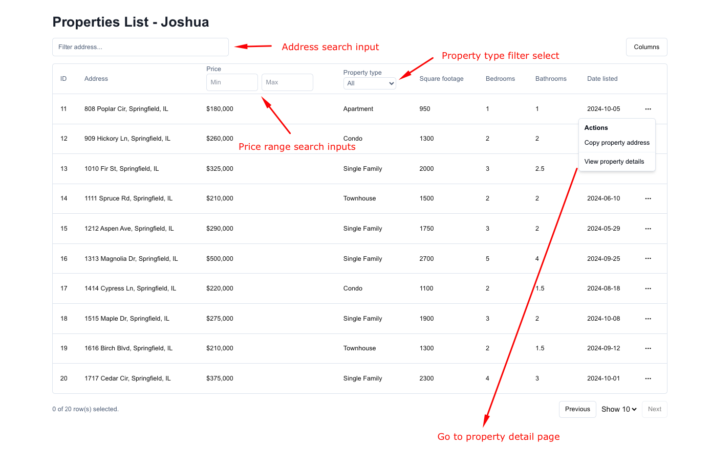
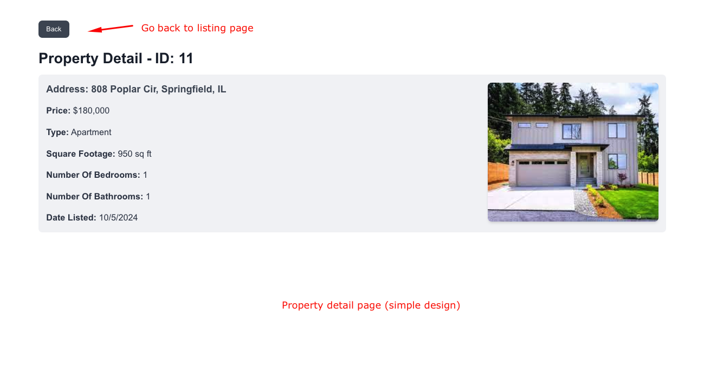

# Property Listing App

This is a property listing web application built with **Next.js**. It allows users to browse and view detailed information about various properties. The app is styled using **TailwindCSS** and uses **ShadCN-UI** for UI components, while **Tanstack React Table** is used for managing the property listing table. The backend is mocked using **Axios Mock Adapter** for fetching property details from a JSON file.

## Features

- Display a list of properties with search and filter functionality.
- View detailed information about each property.
- Fully responsive design optimized for different screen sizes.
- Mock API calls using Axios Mock Adapter to simulate real-world data fetching.

## Tech Stack

### 1. **Next.js v18**
- **Why Next.js?**
  Next.js was chosen for its ability to provide an easy and efficient way to build React applications with both client-side and server-side rendering. It supports page routing out of the box, simplifying the structure of the app.

  - **Key Features:**
    - File-based routing (simplifies navigation between pages).
    - Built-in support for static generation and server-side rendering.
    - Optimized performance with automatic code splitting.

### 2. **Next.js Page Routing**
- **Why Page Routing?**
  Next.js provides automatic routing based on the `pages` directory, making it incredibly easy to create different routes like property listings and property detail pages. This reduces boilerplate code and accelerates development.

### 3. **Axios Mock Adapter**
- **Why Axios Mock Adapter?**
  Axios Mock Adapter was chosen to mock API requests for getting the property list and details. This allows the app to simulate real-time API requests and handle data fetching in a controlled environment, without needing a real backend server.

  - **Key Features:**
    - Easily simulate GET requests.
    - Handle data returned from static JSON files for property listing and detail.

### 4. **TailwindCSS**
- **Why TailwindCSS?**
  TailwindCSS was selected for its utility-first approach, allowing rapid styling with minimal effort. It is highly customizable and helps to maintain a clean and responsive design with less CSS code.

  - **Key Features:**
    - Customizable utility classes for layout and design.
    - Responsive design capabilities built into the framework.
    - No need to write custom CSS for common styling patterns.

### 5. **ShadCN-UI**
- **Why ShadCN-UI?**
  ShadCN-UI provides a set of accessible and customizable UI components for React applications. It helps in building consistent and visually appealing user interfaces without needing to build components from scratch. One of its key advantages is **excellent performance**, ensuring that the app remains fast and responsive even as the user interacts with complex UI elements.

  - **Key Features:**
    - Pre-built UI components.
    - Focus on accessibility and performance.
    - Customizable components for consistent styling.
    - **Good performance**: Optimized for speed, ensuring a smooth user experience even with larger, more dynamic applications.

### 6. **Tanstack React Table**
- **Why Tanstack React Table?**
  Tanstack React Table is used for managing and displaying the property listings in a table format. It provides a lightweight and feature-rich table component with support for sorting, pagination, and filtering, making it perfect for property listing scenarios.

  - **Key Features:**
    - Lightweight and fast.
    - Fully customizable with hooks.
    - Built-in support for filtering, sorting, and pagination.

## How to Run the App

### Prerequisites
- Node.js v16+ (Recommended)

### 1. Clone the repository:
```bash
git clone https://github.com/jsdude0220/property-listing-app.git
cd property-listing-app
```

### 2. Install dependencies:
```bash
npm install
```

### 3. Run the development server:
```bash
npm run dev
```

Visit http://localhost:3000 to view the app in your browser.

## Screenshots

### Property Listing Page

Here is the screenshot of the Property Listing Page where users can see a list of properties:



### Property Detail Page

Here is the screenshot of the Property Detail Page where users can view detailed information about a selected property:

